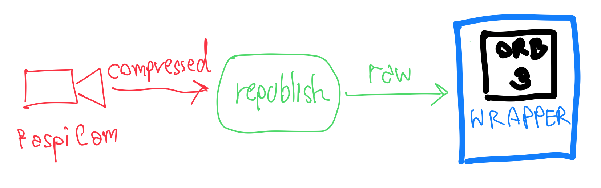
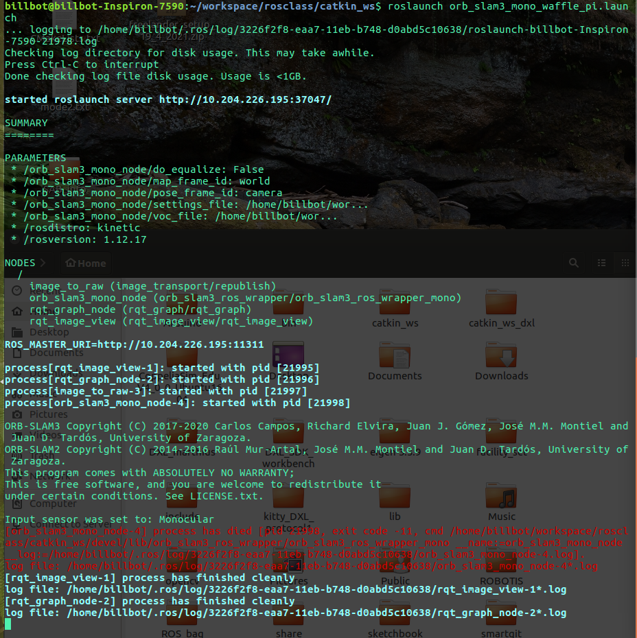
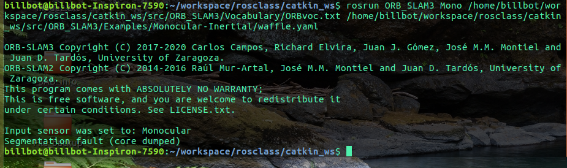

### Monocular ORB-SLAM3 on TurtleBot3: Waffle Pi   ###


**Description**: This tutorial demonstrates SLAM with the newly-released ORB_SLAM3 on a TurtleBot3 Waffle and ROS1. With the bag file provided, we should get the results below: 

[](https://www.youtube.com/watch?v=DjHpCrAqFkc)

The system overview for the essential part is below:



From the compressed video stream from TurtleBot3, a node republishes and un-compresses the stream. The wrapper node will then take the video stream and feed it into the actual ORB_SLAM3 node to perform the SLAM.

**Environment**: ROS1 Noetic / Ubuntu 20.04.2 LTS / [TurtleBot3: Waffle Pi](https://www.robotis.us/turtlebot-3-waffle-pi/) ([Raspberry Pi Camera Module v2](https://www.raspberrypi.org/products/camera-module-v2/))

**`.bashrc`**: MASTER: PC

**Author**: palakon.k_s20@vistec.ac.th

**Table of content:**

- [1. Installing Prerequisites](#1-installing-prerequisites)
  - [1.1. The Basics](#11-the-basics)
  - [1.2. Pangolin](#12-pangolin)
  - [1.3. OpenCV4](#13-opencv4)
    - [1.3.1. Download the packages:](#131-download-the-packages)
    - [1.3.2. Build OpenCV4 (Skip if you have v. 3.3 or later)](#132-build-opencv4-skip-if-you-have-v-33-or-later)
      - [1.3.2.1. Check previous installations](#1321-check-previous-installations)
    - [1.3.3. Check OpenCV4](#133-check-opencv4)
  - [1.4. Eigen](#14-eigen)
- [2. Setup our SLAM System](#2-setup-our-slam-system)
  - [2.1. Build ORB_SLAM3](#21-build-orb_slam3)
  - [2.2. Build ROS wrapper for ORB-SLAM3](#22-build-ros-wrapper-for-orb-slam3)
  - [2.3. yaml for waffle](#23-yaml-for-waffle)
    - [2.3.1. In case not using a Camera from TurtleBot3: Waffle Pi](#231-in-case-not-using-a-camera-from-turtlebot3-waffle-pi)
  - [2.4. Create `launchfile`](#24-create-launchfile)
    - [2.4.1. Line-by-line explanation](#241-line-by-line-explanation)
- [3. Setup Camera (skip for in-class demo)](#3-setup-camera-skip-for-in-class-demo)
  - [3.1. Confirm RPI Camera](#31-confirm-rpi-camera)
  - [3.2. Install camera packages on the TurtleBot3](#32-install-camera-packages-on-the-turtlebot3)
  - [3.3. Calibrate the camera](#33-calibrate-the-camera)
    - [3.3.1. Prepare the Calibration Pattern](#331-prepare-the-calibration-pattern)
    - [3.3.2. Start the node system](#332-start-the-node-system)
    - [3.3.3. Perform the calibration](#333-perform-the-calibration)
    - [3.3.4. See the calibration results](#334-see-the-calibration-results)
- [4. Start SLAM](#4-start-slam)
  - [4.1. SLAM from BAG file data](#41-slam-from-bag-file-data)
  - [4.2. SLAM from the Real TurtleBot3 (if in-class time allow)](#42-slam-from-the-real-turtlebot3-if-in-class-time-allow)
- [5. Bonus activities (skip for in-class demo)](#5-bonus-activities-skip-for-in-class-demo)
- [6. Troubleshooting](#6-troubleshooting)
  - [6.1. `operator/`](#61-operator)
  - [6.2. `CMakelists.txt` error for `opencv` not found](#62-cmakeliststxt-error-for-opencv-not-found)
  - [6.3. Resource not found: turtlebot_bringup](#63-resource-not-found-turtlebot_bringup)
  - [6.4. Bad (python) interpreter](#64-bad-python-interpreter)
  - [6.5. CMake: `MESSAGE` called with incorrect number of arguments](#65-cmake-message-called-with-incorrect-number-of-arguments)
  - [6.6. `[orb_slam3_mono_node-x] process has died`](#66-orb_slam3_mono_node-x-process-has-died)
    - [6.6.1. Segmentation fault (core dumped)](#661-segmentation-fault-core-dumped)
- [7. Additional Resources](#7-additional-resources)


## 1. Installing Prerequisites


### 1.1. The Basics
Install OpenGL, Glew, CMake:
```bash
sudo apt install libgl1-mesa-dev
sudo apt install libglew-dev
sudo apt install cmake
```

Extra dependency:

```bash
sudo apt install libpython2.7-dev
sudo apt install python3-pip
sudo apt install pkg-config
sudo apt install libegl1-mesa-dev libwayland-dev libxkbcommon-dev wayland-protocols
sudo pip3 install numpy pyopengl Pillow pybind11
```

### 1.2. [Pangolin](https://awesomeopensource.com/project/uoip/pangolin)

Install Pangolin
```bash
cd ~
git clone https://github.com/stevenlovegrove/Pangolin.git
cd Pangolin
mkdir build
cd build
cmake ..
cmake --build .
```
### 1.3. OpenCV4
Install OpenCV4 (this will take the whole night)

#### 1.3.1. Download the packages:

```bash
cd ~
# Install minimal prerequisites (Ubuntu 18.04 as reference)
sudo apt update && sudo apt install -y cmake g++ wget unzip
# Download and unpack sources
mkdir -p opencv  && cd opencv
wget -O opencv.zip https://github.com/opencv/opencv/archive/master.zip
wget -O opencv_contrib.zip https://github.com/opencv/opencv_contrib/archive/master.zip
unzip opencv.zip
unzip opencv_contrib.zip
rm *.zip
```

#### 1.3.2. Build OpenCV4 (Skip if you have v. 3.3 or later)

##### 1.3.2.1. Check previous installations

Check below location if/what version we have OpenCV installed:

```bash
ls /usr/local/lib | grep libopencv_core
ls /usr/lib | grep libopencv_core
```

This can be one of the three cases:

- If you already have OpenCV v. 3.3 or later, skip this OpenCV installation.
- If you do not have any OpenCV installed, do proceed with this installation
- If you have OpenCV v. earlier than 3.3, your OpenCV is too old.
  - First, remove the current OpenCV by running:
    ```bash
    sudo rm /usr/local/{bin,lib}/*opencv* 
    ```
  - Then, proceed with the OpenCV installation


```bash
cd ~/opencv
# Create build directory and switch into it
mkdir -p build && cd build
# Configure
cmake -DOPENCV_EXTRA_MODULES_PATH=../opencv_contrib-master/modules ../opencv-master
NPROC=$(nproc)
make -j$NPROC
# Build
cmake --build .
sudo make install
```

#### 1.3.3. Check OpenCV4

```bash
ls /usr/local/lib | grep libopencv_core
ls /usr/lib | grep libopencv_core
```
Should see this

```bash
pkg-config --cflags opencv4
```

Should see this

```bash
-I/usr/include/opencv4/opencv -I/usr/include/opencv4
```

### 1.4. [Eigen](https://eigen.tuxfamily.org/)

Install Eigen
```bash
cd ~
wget https://gitlab.com/libeigen/eigen/-/archive/3.3.9/eigen-3.3.9.tar.gz
tar zxvf eigen-3.3.9.tar.gz
rm eigen-3.3.9.tar.gz
cd eigen-3.3.9
mkdir build
cd build
cmake ..
sudo make install
```


## 2. Setup our SLAM System

There are two steps: 

### 2.1. Build ORB_SLAM3

Install ORB_SLAM3 (which automatically installs DBoW2 and g2o)
```bash
cd ~/catkin_ws/src
git clone https://github.com/UZ-SLAMLab/ORB_SLAM3.git ORB_SLAM3
cd ORB_SLAM3
chmod +x build.sh
```

Then build:

```bash
./build.sh
./build_ros.sh
```

If there is an error, check [6. Troubleshooting](#6-troubleshooting).

### 2.2. Build [ROS wrapper for ORB-SLAM3](https://github.com/thien94/orb_slam3_ros_wrapper)

```bash
cd ~/catkin_ws/src/ 
git clone https://github.com/thien94/orb_slam3_ros_wrapper.git
```

With your favorite editor, open `~/catkin_ws/src/orb_slam3_ros_wrapper/CMakeLists.txt`

```cmake
# Change this to the installation of ORB-SLAM3. 
set(ORB_SLAM3_DIR
   $ENV{HOME}/catkin_ws/src/ORB_SLAM3
)
```
Then build the packages:

```bash
cd ~/catkin_ws/
catkin_make
```

### 2.3. yaml for waffle

Create a new file `~/catkin_ws/src/ORB_SLAM3/Examples/Monocular-Inertial/waffle.yaml`.
Copy-paste content below to it:

```yaml
%YAML:1.0

#--------------------------------------------------------------------------------------------
# Camera Parameters. Adjust them!
#--------------------------------------------------------------------------------------------
Camera.type: "PinHole"

# Camera calibration and distortion parameters (OpenCV)
#     [fx  0 cx]
# K = [ 0 fy cy]
#     [ 0  0  1] 
Camera.fx: 511.14379665531055
Camera.fy: 509.0205888729015
Camera.cx: 311.77052174481076
Camera.cy: 247.45247029125034

# D
Camera.k1: 0.19890011251605139
Camera.k2: -0.31768240010469145
Camera.p1: 0.00225190429372325
Camera.p2: -0.0016667252501190678

# Camera resolution
Camera.width: 640
Camera.height: 480

# Camera frames per second 
Camera.fps: 15.0

# Color order of the images (0: BGR, 1: RGB, ignored if images are grayscale)
Camera.RGB: 1

# Transformation from camera to body-frame (imu)
Tbc: !!opencv-matrix
   rows: 4
   cols: 4
   dt: f
   data: [1., 0.0, 0.0, -0.076,
          0., 1.0, 0.0, -0.000,
         -0., 0.0, 1.0, -0.025,
         0.0, 0.0, 0.0,  1.0]

# IMU noise
IMU.NoiseGyro: 1.7e-4 #1.6968e-04 
IMU.NoiseAcc: 2.0000e-3 #2.0e-3
IMU.GyroWalk: 1.9393e-05 
IMU.AccWalk: 3.0000e-03 # 3e-03
IMU.Frequency: 120

#--------------------------------------------------------------------------------------------
# ORB Parameters
#--------------------------------------------------------------------------------------------

# ORB Extractor: Number of features per image
ORBextractor.nFeatures: 1000 # 1000

# ORB Extractor: Scale factor between levels in the scale pyramid 	
ORBextractor.scaleFactor: 1.2

# ORB Extractor: Number of levels in the scale pyramid	
ORBextractor.nLevels: 8

# ORB Extractor: Fast threshold
# Image is divided in a grid. At each cell FAST are extracted imposing a minimum response.
# Firstly we impose iniThFAST. If no corners are detected we impose a lower value minThFAST
# You can lower these values if your images have low contrast			
ORBextractor.iniThFAST: 20
ORBextractor.minThFAST: 7

#--------------------------------------------------------------------------------------------
# Viewer Parameters
#--------------------------------------------------------------------------------------------
Viewer.KeyFrameSize: 0.05
Viewer.KeyFrameLineWidth: 1
Viewer.GraphLineWidth: 0.9
Viewer.PointSize:2
Viewer.CameraSize: 0.08
Viewer.CameraLineWidth: 3
Viewer.ViewpointX: 0
Viewer.ViewpointY: -0.7
Viewer.ViewpointZ: -3.5 # -1.8
Viewer.ViewpointF: 500
```

#### 2.3.1. In case not using a Camera from TurtleBot3: Waffle Pi  

*When working with the camera from other than this system*, to update the yaml file above, follow the section [3.3. Calibrate the camera](#33-calibrate-the-camera), and shell commands below:

Camera fps to update `Camera.fps:`:

  ```bash
  rostopic hz /raspicam_node/image/compressed
  ```

Transformation from the camera to the IMU using `tf` package to update `Tbc: !!opencv-matrix`:

  ```bash
  rosrun rqt_tf_tree rqt_tf_tree
  rosrun tf tf_echo camera_rgb_frame imu_link
  ```


### 2.4. Create `launchfile`

Create the `launchfile` at `~/catkin_ws/orb_slam3_mono_waffle_pi.launch` with content below:

```xml
<launch> 
    <node name="rqt_image_view" pkg="rqt_image_view" type="rqt_image_view" output="screen" >
    </node>
    <node name="rqt_graph_node" pkg="rqt_graph" type="rqt_graph" output="screen" >
    </node>

    <node name="image_to_raw" pkg="image_transport" type="republish" output="screen" args="compressed in:=/raspicam_node/image/ raw out:=/camera/image_raw">
    </node>
    <!-- ORB-SLAM3 -->
    <node name="orb_slam3_mono_node" pkg="orb_slam3_ros_wrapper" type="orb_slam3_ros_wrapper_mono" output="screen">

        <!-- Parameters for original ORB-SLAM3 -->
        <param name="voc_file"      type="string"   value="$(find ORB_SLAM3)/../../../Vocabulary/ORBvoc.txt" />
        <param name="settings_file" type="string"   value="$(find ORB_SLAM3)/../../Monocular-Inertial/waffle.yaml" />

        <param name="do_equalize"   type="bool"     value="false" />

        <!-- Parameters for ROS -->
        <param name="map_frame_id"  type="string"   value="world" />
        <param name="pose_frame_id" type="string"   value="camera" />
    </node>
</launch>
```

#### 2.4.1. Line-by-line explanation


```xml
<node name="rqt_image_view" pkg="rqt_image_view" type="rqt_image_view" output="screen" >
</node>
<node name="rqt_graph_node" pkg="rqt_graph" type="rqt_graph" output="screen" >
</node>
```
These are the two nodes to view the videos stream from the TurtleBot3 and ROS's node graph.

```xml
<node name="image_to_raw" pkg="image_transport" type="republish" output="screen" args="compressed in:=/raspicam_node/image/ raw out:=/camera/image_raw">
</node>
```
The `rpicam` hardware compresses the video stream by default for the good reasons. The SLAM node cannot digest the compressed stream directly. The `image_to_raw` node is for converting such `compressed` streams back to `raw` stream. `/camera/image_raw` is the topic that our SLAM node is subscribing to.

```xml
<!-- ORB-SLAM3 -->
<node name="orb_slam3_mono_node" pkg="orb_slam3_ros_wrapper" type="orb_slam3_ros_wrapper_mono" output="screen">
    <!-- Parameters for original ORB-SLAM3 -->
    <param name="voc_file"      type="string"   value="$(find ORB_SLAM3)/../../../Vocabulary/ORBvoc.txt" />
    <param name="settings_file" type="string"   value="$(find ORB_SLAM3)/../../Monocular-Inertial/waffle.yaml" />

    <param name="do_equalize"   type="bool"     value="false" />

    <!-- Parameters for ROS -->
    <param name="map_frame_id"  type="string"   value="world" />
    <param name="pose_frame_id" type="string"   value="camera" />
</node>
```
Above is the parameters for the ORB_SLAM3 algorithms. We can see that the node will take our `waffle.yaml` as the `settings_file` argument.

## 3. Setup Camera (skip for in-class demo)

### 3.1. Confirm RPI Camera

We follow the official [Raspberry Pi Camera tutorial](https://emanual.robotis.com/docs/en/platform/turtlebot3/appendix_raspi_cam/).

```bash 
ssh pi@<turtlebot's IP Address>
```

First, edit the camera configuration:

```bash
sudo raspi-config
```

Select `Interfacing Options`, and `Camera`.
After enabling the camera, you should see the screen below with the message 'The camera interface is enabled' below.


Then select `ok`, `Finish`, and reboot the TurtleBot3.

```bash
sudo reboot
```
Access the TurtleBot3 again:

```bash 
ssh pi@<turtlebot's IP Address>
```

Take a photo: (say cheese!)
```bash
raspistill -v -o test.jpg

```

From the PC (not the TurtleBot3's) terminal, copy the newly taken photo to your PC.

```bash
cd ~/catkin_ws
scp pi@<turtlebot's IP Address>:~/test.jpg .
```

Now see your photo!


You can see the quality and resolution of the camera!

### 3.2. Install camera packages on the TurtleBot3

On TurtleBot3:
```bash
cd ~/catkin_ws/src
git clone https://github.com/UbiquityRobotics/raspicam_node.git
sudo apt-get install ros-kinetic-compressed-image-transport ros-kinetic-camera-info-manager
cd ~/catkin_ws && catkin_make
```

Then, try asking the TurtleBot3 to publish the image:

```bash
roslaunch turtlebot3_bringup turtlebot3_rpicamera.launch
```

On PC (with the configured MASTER IP Addresses), use `rqt_image_view` to show the image.

```bash
rqt_image_view
```


### 3.3. Calibrate the camera

There are ways on obtaining the camera *intrinsic parameters*, one of them is below:

#### 3.3.1. Prepare the Calibration Pattern
- Print out on paper the [Checkerboard Pattern](https://www.mrpt.org/downloads/camera-calibration-checker-board_9x7.pdf). This particular pattern size is a `9x7` or `7x9` pattern (counting the *internal corners*). You can make it durable and your friend will borrow it to calibrate their cameras for years to come.
-  Attach the paper to a moveable, flat surface (corrugated board, future board, or a laptop, etc.) because we need to move the pattern around in front of the camera. Or you could attach the pattern to a wall and move the camera; possible, but less convenient.
-  Measure the width of *one* square. It could be 0.02 m as the file mentioned, or a different size if you print it on, for example, an A3 paper.

I used a different calibration pattern (a *loan for use* from a friend so I do not have to go through the steps above). The specifications are below:

| Calibration Pattern | My friend's | This tutorial's |
| ------------------- | ----------- | --------------- |
| Size                | `9x6`       | `9x7`           |
| Square's width      | 0.02373 m   | 0.02 m ??       |

#### 3.3.2. Start the node system

  Bring up TurtleBot3's camera
    
- On TurtleBot3, 

  ```bash
  rosrun raspicam_node raspicam_node
  ```

- On PC, 
  - Terminal#1: To provide an uncompressed the video stream
    ```bash
    rosrun image_transport republish compressed in:=/raspicam_node/image/ raw out:=/camera/image_raw
    ```

  - Terminal#2: To start the calibration node
    
    Use your `--size` and `--square` parameters as per [3.3.1. Prepare the Calibration Pattern](#331-prepare-the-calibration-pattern); it could look similar to below:
    ```bash
    rosrun camera_calibration cameracalibrator.py --size 9x7 --square 0.02 image:=/camera/image_raw camera:=/raspicam_node
    ```

#### 3.3.3. Perform the calibration

- Move, and skew the pattern around to cover the camera field of view. 
- In each image frame, when the calibration node detects the pattern, it draws lines connecting the corners. 

- When the system detects enough frames, the `CALIBRATE` button is enabled.

  

- Click `CALIBRATE` 
  
  

- Wait for the calibration process
  
  

- Click `SAVE`, and `COMMIT`. According to the [Package Summary](http://wiki.ros.org/camera_calibration), *When the user presses the `CALIBRATE` button, the node computes the camera calibration parameters. When the user clicks `COMMIT`, the node uploads these new calibration parameters to the camera driver using a service call.*
  
#### 3.3.4. See the calibration results

We can see the same calibration results inside the terminal, in yaml, and in text files.

- From the Terminal
  ```bash
  mono pinhole calibration...
  D = [0.19890011251605139, -0.31768240010469145, 0.00225190429372325, -0.0016667252501190678, 0.0]
  K = [511.14379665531055, 0.0, 311.77052174481076, 0.0, 509.0205888729015, 247.45247029125034, 0.0, 0.0, 1.0]
  R = [1.0, 0.0, 0.0, 0.0, 1.0, 0.0, 0.0, 0.0, 1.0]
  P = [525.563232421875, 0.0, 310.04905644909013, 0.0, 0.0, 524.0479125976562, 247.7008932694298, 0.0, 0.0, 0.0, 1.0, 0.0]
  None
  # oST version 5.0 parameters


  [image]

  width
  640

  height
  480

  [narrow_stereo]

  camera matrix
  511.143797 0.000000 311.770522
  0.000000 509.020589 247.452470
  0.000000 0.000000 1.000000

  distortion
  0.198900 -0.317682 0.002252 -0.001667 0.000000

  rectification
  1.000000 0.000000 0.000000
  0.000000 1.000000 0.000000
  0.000000 0.000000 1.000000

  projection
  525.563232 0.000000 310.049056 0.000000
  0.000000 524.047913 247.700893 0.000000
  0.000000 0.000000 1.000000 0.000000

  ('Wrote calibration data to', '/tmp/calibrationdata.tar.gz')
  ```
- From the output files:

  Let's copy it to `~/catkin_ws` for later references: calibration results along with the image frames:

  ```bash
  cp /tmp/calibrationdata.tar.gz ~/catkin_ws
  ```

  

  - ost.txt

    ```
    # oST version 5.0 parameters


    [image]

    width
    640

    height
    480

    [narrow_stereo]

    camera matrix
    511.143797 0.000000 311.770522
    0.000000 509.020589 247.452470
    0.000000 0.000000 1.000000

    distortion
    0.198900 -0.317682 0.002252 -0.001667 0.000000

    rectification
    1.000000 0.000000 0.000000
    0.000000 1.000000 0.000000
    0.000000 0.000000 1.000000

    projection
    507.718292 0.000000 307.882255 0.000000
    0.000000 504.573120 249.457519 0.000000
    0.000000 0.000000 1.000000 0.000000
    ```

  - YAML file:

    ```yaml
    image_width: 640
    image_height: 480
    camera_name: narrow_stereo
    camera_matrix:
      rows: 3
      cols: 3
      data: [511.1438 ,   0.     , 311.77052,
              1.     , 509.02059, 247.45247,
              2.     ,   0.     ,   1.     ]
    distortion_model: plumb_bob
    distortion_coefficients:
      rows: 1
      cols: 5
      data: [0.198900, -0.317682, 0.002252, -0.001667, 0.000000]
    rectification_matrix:
      rows: 3
      cols: 3
      data: [1., 0., 0.,
            0., 1., 0.,
            0., 0., 1.]
    projection_matrix:
      rows: 3
      cols: 4
      data: [507.71829,   0.     , 307.88226,   0.     ,
              1.     , 504.57312, 249.45752,   0.     ,
              2.     ,   0.     ,   1.     ,   0.     ]
    ```


## 4. Start SLAM

There are two ways we can try in this tutorial: BAG file, and video stream from the TurtleBot3

### 4.1. SLAM from BAG file data
  
  On MASTER/PC

  Starting from all terminal closed...

  - Terminal #1: Make sure the `roscore` is up below any other node
    ```bash
    roscore
    ```
  - Terminal #2: Launch the `launchfile`

    ```bash
    roslaunch ~/catkin_ws/orb_slam3_mono_waffle_pi.launch
    ```

- Terminal #3: Play the BAG file 
  - Download [BAG file](https://vistec-my.sharepoint.com/:u:/g/personal/palakon_k_s20_vistec_ac_th/EUcxgW82HLxOsKVx4ZWsH6wBG2HSVLeCOWiU9KAV1KvR-w?e=MO6nBt) (~1.5GB) and move it to `~/catkin_ws`.
  - Run BAG file
    ```bash
    cd ~/catkin_ws
    rosbag play ORB_SLAM3_Monocular_2021-07-18-08-27-30.bag
    ```

### 4.2. SLAM from the Real TurtleBot3 (if in-class time allow)

To run on real TurtleBot3, instead of playing the BAG file above, we will bring up the TurtleBot3.

Starting from all terminal closed...

- On MASTER/PC

  - Terminal #1: Make sure the `roscore` is up below any other node
    ```bash
    roscore
    ```
- On TurtleBot3
  - Terminal #1: Bring up TurtleBot3
    ```bash
    roslaunch turtlebot3_bringup turtlebot3_robot.launch
    ```
  - Terminal #2: Start RPI Camera
    ```bash
    roslaunch turtlebot3_bringup turtlebot3_rpicamera.launch
    ```

- On MASTER/PC
  - Terminal #2: Launch the `launchfile`

    ```bash
    roslaunch ~/catkin_ws/orb_slam3_mono_waffle_pi.launch
    ```
  - Terminal #3: Teleop node

    ```bash
    roslaunch turtlebot3_teleop turtlebot3_teleop_key.launch
    ```


## 5. Bonus activities (skip for in-class demo)
For advanced users, you are encouraged to try additional tasks below:
| Tasks                                                             | Level                                                        |
| ----------------------------------------------------------------- | ------------------------------------------------------------ |
| Check what messages are published from `orb_slam3_mono_node` node | One shell cmd                                                |
| Visualize the published data in `rviz`                            | One shell cmd and correct `rviz settings`                    |
| With the published data, perform 3D SLAM using RTAB-Map           | Install RTAB-Map package and bride data/parameters correctly |
| Instead of the BAG file or the TurtleBot3, run the SLAM on Gazebo | One shell cmd and ensure correct topic names                 |
| ORB_SLAM3 on Monocular camera and the IMU                         | Update setting/calibration in the yaml file                  |

## 6. Troubleshooting

### 6.1. `operator/`
If we see below error during building the ORB-SLAM3:
```bash
.../catkin_ws/src/ORB_SLAM3/src/LocalMapping.cc:628:49: error: no match for ‘operator/’ (operand types are ‘cv::Matx<float, 3, 1>’ and ‘float’)
  628 |                 x3D = x3D_h.get_minor<3,1>(0,0) / x3D_h(3);
      |                       ~~~~~~~~~~~~~~~~~~~~~~~~~ ^ ~~~~~~~~
      |                                           |            |
      |                                           |            float
      |                                           cv::Matx<float, 3, 1>

.../catkin_ws/src/ORB_SLAM3/src/CameraModels/KannalaBrandt8.cpp:534:41: error: no match for ‘operator/’ (operand types are ‘cv::Matx<float, 3, 1>’ and ‘float’)
  534 |         x3D = x3D_h.get_minor<3,1>(0,0) / x3D_h(3);
      |               ~~~~~~~~~~~~~~~~~~~~~~~~~ ^ ~~~~~~~~
      |                                   |            |
      |                                   |            float
      |                                   cv::Matx<float, 3, 1>

```

We will follow this [link](https://www.gitmemory.com/issue/UZ-SLAMLab/ORB_SLAM3/300/825438613) to replace 

```cpp
x3D = x3D_h.get_minor<3,1>(0,0) / x3D_h(3);
```
with
```cpp
x3D = cv::Matx31f(x3D_h.get_minor<3,1>(0,0)(0) / x3D_h(3), x3D_h.get_minor<3,1>(0,0)(1) / x3D_h(3), x3D_h.get_minor<3,1>(0,0)(2) / x3D_h(3));
```
on both source files `~/catkin_ws/src/ORB_SLAM3/src/CameraModels/KannalaBrandt8.cpp` and `~/catkin_ws/src/ORB_SLAM3/src/LocalMapping.cc`


### 6.2. `CMakelists.txt` error for `opencv` not found

Edit `~/catkin_ws/src/ORB_SLAM3/CMakeLists.txt` at line 37:

Replace with

```cmake
# find_package(OpenCV 4.0)
find_package(OpenCV 4.0 REQUIRED PATHS "/usr/include/opencv4" )
```

Edit `~/catkin_ws/src/ORB_SLAM3/Examples/ROS/ORB_SLAM3/CMakeLists.txt` at line 37:

Replace with

```cmake
# find_package(OpenCV 3.0 QUIET)
find_package(OpenCV 4.0 REQUIRED PATHS "/usr/include/opencv4" )
```

The `"/usr/include/opencv4"` was obtained from [1.3.3. Check OpenCV4](#133-check-opencv4)
### 6.3. Resource not found: turtlebot_bringup
```bash
Resource not found: turtlebot_bringup
```

Edit the launch file to seek `turtlebot3_bringup` instead.


### 6.4. Bad (python) interpreter

When seeing the error messages similar to below: 

```bash
/opt/ros/noetic/bin/rosrun: /opt/ros/noetic/lib/camera_calibration/cameracalibrator.py: /usr/bin/python: bad interpreter: No such file or directory
/opt/ros/noetic/bin/rosrun: line 150: /opt/ros/noetic/lib/camera_calibration/cameracalibrator.py: Success
```

it means that the shell is looking for the python interpreter at the path `/usr/bin/python` which is not existed. 

In most cases we do have the python interpreter, but at a different path; we will have to run a shell command to create a symbolic link.

```bash
cd /usr/bin
sudo ln -fs /usr/bin/python3 python
```

### 6.5. CMake: `MESSAGE` called with incorrect number of arguments 

To solve, commenting out the line 45 of `~/catkin_ws/src/ORB_SLAM3/CMakeLists.txt`:

```cmake
...
endif()

MESSAGE("OPENCV VERSION:")
#MESSAGE(${OpenCV_VERSION})

find_package(Eigen3 3.1.0 REQUIRED)
...
```
### 6.6. `[orb_slam3_mono_node-x] process has died`

When seeing the error messages similar to below:



We could investigate further by running:

```bash
rosrun ORB_SLAM3 Mono ~/catkin_ws/ORB_SLAM3/Vocabulary/ORBvoc.txt ~/catkin_ws/src/ORB_SLAM3/Examples/Monocular-Inertial/waffle.yaml
```
Observe the output from the terminal, they can be one of the two cases below:

#### 6.6.1. Segmentation fault (core dumped)



(cr. Joe Chu)

If this happens, do try on a machine with the recommended OS and ROS version.


## 7. Additional Resources
For additional resources please visit below:
-  [ORM_SLAM3](https://github.com/UZ-SLAMLab/ORB_SLAM3) 
- [ROS communities](http://wiki.ros.org/)
- [Raspberry Pi Camera](https://emanual.robotis.com/docs/en/platform/turtlebot3/appendix_raspi_cam/)
- [ROS wrapper for ORB-SLAM3](https://github.com/thien94/orb_slam3_ros_wrapper)
- [/camera_info](http://docs.ros.org/en/noetic/api/sensor_msgs/html/msg/CameraInfo.html)
- [RTAB-Map](http://wiki.ros.org/rtabmap_ros)
- [Pangolin](https://awesomeopensource.com/project/uoip/pangolin)